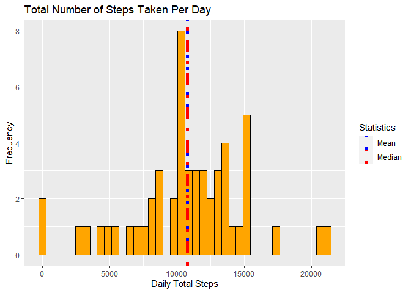

```r
## Load the Required Packages
library(dplyr)
```

```
## 
## Attaching package: 'dplyr'
```

```
## The following objects are masked from 'package:stats':
## 
##     filter, lag
```

```
## The following objects are masked from 'package:base':
## 
##     intersect, setdiff, setequal, union
```

```r
library(ggplot2)
```

```
## Warning: package 'ggplot2' was built under R version 4.0.2
```

```r
library(lattice)
library(xtable)
```

```
## Warning: package 'xtable' was built under R version 4.0.2
```


## 1. Loading and preprocessing the data

### 1.1. Load the data
Unzip and load the data.

```r
unzip("activity.zip")
activity <- read.csv("activity.csv")
```

### 1.2. Process/transform the data into a format suitable for your analysis

Convert the date field from the character representation to `Date` class.
Preview and summarize the resulting dataset we have.

```r
activity$date <- as.Date(as.character(activity$date), "%Y-%m-%d")
str(activity)
```

```
## 'data.frame':	17568 obs. of  3 variables:
##  $ steps   : int  NA NA NA NA NA NA NA NA NA NA ...
##  $ date    : Date, format: "2012-10-01" "2012-10-01" ...
##  $ interval: int  0 5 10 15 20 25 30 35 40 45 ...
```

```r
summary(activity)
```

```
##      steps             date               interval     
##  Min.   :  0.00   Min.   :2012-10-01   Min.   :   0.0  
##  1st Qu.:  0.00   1st Qu.:2012-10-16   1st Qu.: 588.8  
##  Median :  0.00   Median :2012-10-31   Median :1177.5  
##  Mean   : 37.38   Mean   :2012-10-31   Mean   :1177.5  
##  3rd Qu.: 12.00   3rd Qu.:2012-11-15   3rd Qu.:1766.2  
##  Max.   :806.00   Max.   :2012-11-30   Max.   :2355.0  
##  NA's   :2304
```

We can see that there are **2304** missing values out of the total **17568**
observations in our dataset. For now, we will ignore the missing values.

## 2. What is mean total number of steps taken per day?

### 2.1. Calculate the total number of steps taken per day

```r
steps_per_day <- aggregate(steps ~ date, activity, sum, na.action = na.omit)

## Calculate the mean and median of the total number of steps taken per day
steps_mean <- with(steps_per_day, mean(steps, na.rm = TRUE)) %>%
                  round(0) %>% as.integer()
steps_median <- with(steps_per_day, median(steps, na.rm = TRUE)) %>%
                    round(0) %>% as.integer()
```

### 2.2. Make a histogram of the total number of steps taken each day

```r
## Make a histogram of the total number of steps taken per day
g <- ggplot(steps_per_day, aes(steps))
g + geom_histogram(col = "black", fill = "orange", bins = 40) +
    labs(x = "Daily Total Steps", y = "Frequency") +
    labs(title = "Total Number of Steps Taken Per Day") +
    geom_vline(aes(xintercept = steps_mean, col = "Mean"),
               linetype = 3, size = 2) +
    geom_vline(aes(xintercept = steps_median, col = "Median"),
               linetype = 4, size = 2) +
    scale_color_manual(name = "Statistics",
                       values = c(Mean = "blue", Median = "red"))
```

<!-- -->

### 2.3. Report the mean and median of the total number of steps taken per day
Mean of the total number of steps taken per day = **10766**  
Median of the total number of steps taken per day = **10765**

## 3. What is the average daily activity pattern?

### 3.1. Make a time series plot
Make a time series plot (i.e. type = "l") of the 5-minute interval (x-axis) and
the average number of steps taken, averaged across all days (y-axis)

```r
steps_avg_interval <- aggregate(steps ~ interval, activity, mean,
                                na.action = na.omit)

with(steps_avg_interval,
     plot(steps ~ interval, type = "l", lwd = 2, col = "orange",
          xlab = "5-minute Interval",
          ylab = "Steps Averaged Across All Days"))
```

<!-- -->

### 3.2. The Interval with maximum average steps
Which 5-minute interval, on average across all the days in the dataset, contains
the maximum number of steps?


```r
max_steps_idx <- which.max(steps_avg_interval[, "steps"])
max_steps <- steps_avg_interval[max_steps_idx, "steps"] %>%
                round(0) %>% as.integer()
max_interval <- steps_avg_interval[max_steps_idx, "interval"] %>%
                    round(0) %>% as.integer()
steps_avg_interval[max_steps_idx, ]
```

```
##     interval    steps
## 104      835 206.1698
```

The 5-minuter interval: **835**, on average across all the
days contains the maximum number of steps: **206**. Surely they don't
have any meetings scheduled around
**8:35**
**am**!!

## 4. Imputing missing values

### 4.1. Total missing values
Calculate and report the total number of missing values in the dataset (i.e. the
total number of rows with NAs)

```r
missing_val_count <- with(activity, sum(is.na(steps)))
missing_val_percent <- (with(activity, mean(is.na(steps))) * 100)
```

There is a total of **2304** missing values (NAs) in the
dataset (consistent with the summary in step 1.2.). It constitutes of
**~13%** of the total observations in the
dataset.

### 4.2. Strategy for imputing missing values
Devise a strategy for filling in all of the missing values in the dataset. The
strategy does not need to be sophisticated. For example, you could use the
mean/median for that day, or the mean for that 5-minute interval, etc.

In this example, missing values of a 5-minute interval have been imputed with
the average number of steps taken in that interval, averaged across all days.
This was already calculated in step 3 above.

### 4.3. Create a new dataset = original dataset + missing data filled in.

```r
activity_imp <- activity

get_avg_steps_for_interval <- function(interval) {
  steps_avg_interval[steps_avg_interval$interval == interval, ]["steps"] %>%
      round(0) %>% as.integer()
}

for(i in 1:nrow(activity_imp)) {
    if(is.na(activity_imp[i, ]$steps)) {
       activity_imp[i, ]$steps <-
           get_avg_steps_for_interval(activity_imp[i, ]$interval)
    }
}
```

### 4.4. Make a histogram of the total number of Steps taken each day

```r
## Calculate the total number of steps taken per day
steps_per_day_imp <- aggregate(steps ~ date, activity_imp, sum)

## Calculate the mean and median of the total number of steps taken per day
steps_mean_imp <- with(steps_per_day_imp, mean(steps)) %>%
                      round(0) %>% as.integer()
steps_median_imp <- with(steps_per_day_imp, median(steps)) %>%
                        round(0) %>% as.integer()

## Make a histogram of the total number of steps taken per day
g <- ggplot(steps_per_day_imp, aes(steps))
g + geom_histogram(col = "black", fill = "orange", bins = 40) +
    labs(x = "Daily Total Steps", y = "Frequency") +
    labs(title = "Total Number of Steps Taken Per Day") +
    geom_vline(aes(xintercept = steps_mean_imp, col = "Mean"),
               linetype = 3, size = 2) +
    geom_vline(aes(xintercept = steps_median_imp, col = "Median"),
               linetype = 4, size = 2) +
    scale_color_manual(name = "Statistics",
                       values = c(Mean = "blue", Median = "red"))
```

<!-- -->

Mean of the total number of steps taken per day =
**10766**  
Median of the total number of steps taken per day = **10762**


```r
report <- matrix(c(steps_mean, steps_mean_imp, steps_median, steps_median_imp),
                 nrow = 2,
                 dimnames = list(c("With NAs", "NAs Imputed"),
                                 c("Mean", "Median")))
report <- xtable(report)
print(report, type = "html")
```

<!-- html table generated in R 4.0.1 by xtable 1.8-4 package -->
<!-- Tue Sep 01 19:15:43 2020 -->
<table border=1>
<tr> <th>  </th> <th> Mean </th> <th> Median </th>  </tr>
  <tr> <td align="right"> With NAs </td> <td align="right"> 10766 </td> <td align="right"> 10765 </td> </tr>
  <tr> <td align="right"> NAs Imputed </td> <td align="right"> 10766 </td> <td align="right"> 10762 </td> </tr>
   </table>

The means of the original and imputed dataset are 10766 and
10766 respectively; no change in the mean. No surprise, the mean
was used to impute missing data. The median though has changed from
10765 to 10762, a small change.

After imputing the missing data it seems the higher frequency counts in the
histogram are more close to the mean and median.

## 5. Are there differences in activity patterns between weekdays and weekends?

### 5.1. Create a new factor variable with two levels – “weekday” and “weekend”
Add a column named daytype which will hold the information of whether a given
date is a weekday or a weekend (Assuming Saturday and Sunday are weekends).

```r
weekends <- c("Saturday", "Sunday")
daytype <- c("weekday", "weekend")
activity_imp$daytype <- daytype[(weekdays(activity_imp$date) %in% weekends) + 1]
activity_imp$daytype <- as.factor(activity_imp$daytype)
str(activity_imp)
```

```
## 'data.frame':	17568 obs. of  4 variables:
##  $ steps   : int  2 0 0 0 0 2 1 1 0 1 ...
##  $ date    : Date, format: "2012-10-01" "2012-10-01" ...
##  $ interval: int  0 5 10 15 20 25 30 35 40 45 ...
##  $ daytype : Factor w/ 2 levels "weekday","weekend": 1 1 1 1 1 1 1 1 1 1 ...
```

### 5.2. Make a panel plot containing a time series plot: Weekdays v/s Weekends
Make a panel plot containing a time series plot (i.e. type = "l") of the
5-minute interval (x-axis) and the average number of steps taken, averaged
across all weekday days or weekend days (y-axis).

```r
steps_avg_daytype_interval <- aggregate(steps ~ daytype + interval,
                                        activity_imp, mean)
xyplot(steps ~ interval | daytype, data = steps_avg_daytype_interval,
       layout = c(1, 2), type = "l", lty = 1, col = "orange",
       xlab = "Interval", ylab = "Number of Steps")
```

<!-- -->


```r
max_steps_idx <- which.max(steps_avg_daytype_interval[, "steps"])
max_steps <- steps_avg_interval[max_steps_idx, "steps"] %>%
                round(0) %>% as.integer()
max_interval <- steps_avg_interval[max_steps_idx, "interval"] %>%
                    round(0) %>% as.integer()
steps_avg_interval[max_steps, ]
```

```
##    interval    steps
## 51      410 2.566038
```

It seems the activities start in weekdays earlier (5 - 6 am) than the weekends
(8 am). It also seems, from 10 am to 5 pm, the weekends have higher activity
levels than the weekdays. Tech geeks but enthusiasts in true sense!!
